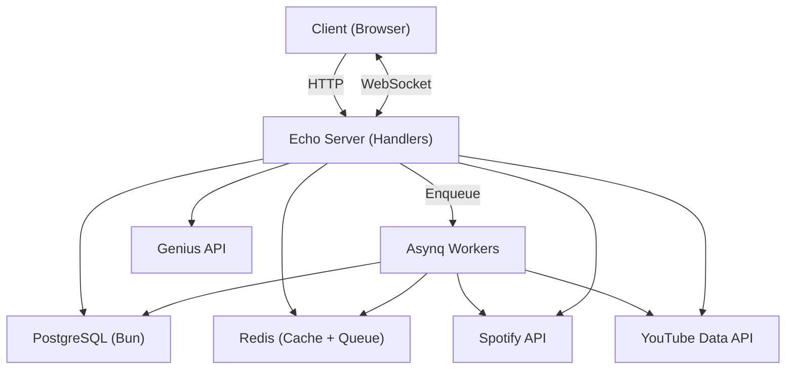

# sptyt

Convert Spotify playlists and albums to YouTube playlists. Background workers, real-time progress over WebSockets, multi-strategy track matching with caching.

## Why This Exists

You have a Spotify playlist. You want it on YouTube. Sounds simple until you realize Spotify and YouTube have no shared identifier for most tracks. There's no API that maps one to the other. You're left searching YouTube for each track by name and hoping the right video comes back.

sptyt automates this. It fetches your Spotify playlist, matches each track to a YouTube video using a tiered search strategy, creates a YouTube playlist under your account, and adds the matched videos. The whole thing runs asynchronously with real-time progress updates.

## Architecture



Three layers:

**HTTP handlers** accept requests, validate input, and enqueue background tasks. They never do long-running work inline. A playlist conversion request returns `202 Accepted` immediately with a conversion ID.

**Asynq workers** (Redis-backed) pick up conversion tasks and run the actual matching + playlist creation. Each worker gets a `TokenManager` that auto-refreshes YouTube OAuth tokens mid-conversion so long playlists don't fail halfway through.

**WebSocket hub** (Redis pub/sub for multi-server) pushes real-time progress events to connected clients. Every 5 matched tracks, the client gets an update with current counts and the track being processed.

## Track Matching

This is the core problem. Given a Spotify track (name + artists), find the right YouTube video.

```go
// Strategy 1: Official Music Video (default)
videoURL, err = s.youtubeClient.SearchOfficialMVWithToken(ctx, accessToken, track.Name, artistsStr)

// Strategy 2: Lyric Video (fallback, or preferred if user requests)
videoURL, err = s.youtubeClient.SearchLyricVideoWithToken(ctx, accessToken, track.Name, artistsStr)
```

Two strategies, tried in order. The user can flip to lyric-video-first mode. Both use the user's own OAuth token so quota burns against their Google account, not the server's API key.

Results are cached in Redis with normalized keys (lowercased, whitespace-collapsed). Cache hits skip the YouTube API entirely. Misses are also cached (6h TTL) to avoid repeatedly searching for tracks YouTube simply doesn't have.

```
yt:search:mv:taylor swift:anti hero    → { video_id, url, match_method }
yt:search:lyric:taylor swift:anti hero → { video_id, url, match_method }
```

Worker pool runs 5 goroutines matching tracks concurrently. Results are collected via channels and sorted by original playlist index before being added to the YouTube playlist:

```go
sort.Slice(results, func(i, j int) bool {
    return results[i].Index < results[j].Index
})
```

## Token Management

YouTube OAuth tokens expire in ~1 hour. A playlist with 100 tracks can take longer than that. The `TokenManager` handles this transparently:

```go
func (tm *TokenManager) GetAccessToken(ctx context.Context) (string, error) {
    tm.mu.Lock()
    defer tm.mu.Unlock()

    // Cached token still valid (with 5min buffer)?
    if tm.accessToken != "" && time.Until(tm.expiresAt) > 5*time.Minute {
        return tm.accessToken, nil
    }

    // Fetch from DB, decrypt, refresh if expiring
    token := /* ... fetch from postgres ... */
    token.AccessToken, _ = crypto.Decrypt(token.AccessToken)
    token.RefreshToken, _ = crypto.Decrypt(token.RefreshToken)

    if time.Until(token.ExpiresAt) < 5*time.Minute {
        refreshed := tm.refreshToken(ctx, &token) // POST to Google, encrypt, persist
        tm.accessToken = refreshed.AccessToken
    }
    return tm.accessToken, nil
}
```

Tokens are encrypted at rest with AES-256-GCM. The `enc:` prefix distinguishes encrypted values from legacy plaintext, so existing databases migrate transparently.

## Smart Links

Beyond playlist conversion, sptyt acts as a universal music link redirector:

```
sptyt.xyz/:link          → auto-detect Spotify/YouTube, redirect to counterpart
sptyt.xyz/ly/:link       → force lyric video match
sptyt.xyz/gn/:link       → redirect to Genius lyrics
sptyt.xyz/yt/:link       → YouTube → Spotify reverse lookup
```

Mobile detection converts web URLs to native app deep links (`spotify://`, `youtube://`). Everything is cached in Redis with 1-24h TTLs depending on volatility.

## Caching Strategy

Every external API call is fronted by Redis:

| Key Pattern | TTL | What |
|---|---|---|
| `track:<id>` | 24h | Spotify track metadata |
| `track:details:<id>` | 24h | Full track details (cover, duration) |
| `yt:search:mv:<key>` | 1h | YouTube MV search results |
| `yt:search:lyric:<key>` | 1h | YouTube lyric video results |
| `spotify:search:<limit>:<query>` | 1h | Spotify search results |
| `youtube:mv:<trackID>` | 1h | Resolved YouTube MV URLs |
| `genius:<trackID>` | 1h | Genius lyrics URLs |

Negative caching (track not found on YouTube) uses a 6h TTL. This prevents burning API quota on repeated searches for the same track that YouTube simply doesn't have.

## Quota Tracking

YouTube Data API v3 has a daily quota of 10,000 units. Search costs 100, playlist insert costs 50. sptyt tracks quota per Google account email (not per user), because quota is tied to the OAuth credential:

```go
type YouTubeAccountQuota struct {
    AccountEmail         string    // unique, PK
    DailySearches        int
    DailyPlaylistInserts int
    LastQuotaResetDate   time.Time // resets at UTC midnight
}
```

Monthly conversion limits are enforced application-side (50/month, 100 songs/playlist). The counter increments before the async job starts -- not after -- to prevent concurrent requests from bypassing limits.

## Custom Bento Links

Users can create shareable link pages with a grid layout:

- Song cards with Spotify/YouTube/Genius links
- Playlist cards from converted playlists
- Custom text blocks, images, social links
- Password protection (bcrypt, rate-limited to 5 attempts/min)
- Per-element styling (colors, gradients, borders)
- View and click analytics

## API

### Public
```
GET  /:link                              Smart redirect
GET  /ly/:link                           Lyric video redirect
GET  /gn/:link                           Genius lyrics redirect
GET  /yt/:youtube_link                   YouTube → Spotify
GET  /api/l/:slug                        Public custom link
POST /api/l/:slug/verify                 Password verification
```

### Protected (Clerk auth)
```
POST /api/playlists/convert              Start conversion
GET  /api/playlists/conversions          List conversions
GET  /api/playlists/conversions/:id      Conversion status
POST /api/playlists/conversions/:id/retry  Retry failed tracks
GET  /api/ws/playlist-progress           WebSocket progress
GET  /api/auth/youtube/authorize         Start YouTube OAuth
GET  /api/analytics/monthly              Usage stats
POST /api/links                          Create custom link
```

## Stack

| Component | Choice |
|---|---|
| Language | Go |
| Web framework | Echo v4 |
| Database | PostgreSQL (Bun ORM) |
| Cache + queue | Redis (go-redis + Asynq) |
| Auth | Clerk (JWT) |
| YouTube auth | OAuth 2.0 with auto-refresh |
| Real-time | WebSocket (gorilla) + Redis pub/sub |
| Token encryption | AES-256-GCM |

## Running

```bash
cp .env.example .env
# Fill in: SPOTIFY_CLIENT_ID, SPOTIFY_CLIENT_SECRET, YOUTUBE_API_KEY,
#          YOUTUBE_OAUTH_CLIENT_ID, YOUTUBE_OAUTH_CLIENT_SECRET,
#          GENIUS_ACCESS_TOKEN, CLERK_SECRET_KEY
# Optional: TOKEN_ENCRYPTION_KEY (base64-encoded 32 bytes for token encryption)

docker compose up -d   # postgres + redis
go run main.go
```

## Key Design Decisions

**Why Asynq instead of inline processing?** Playlist conversion can take minutes for large playlists. Inline processing would tie up HTTP connections and risk timeouts. Asynq gives us retries (max 3), timeouts (30min), and the client gets immediate feedback via WebSocket.

**Why user OAuth tokens for YouTube search?** YouTube API quota is per-project. If the server's API key handles all searches, one popular day burns the quota for everyone. By using each user's OAuth token, quota distributes naturally across users.

**Why encrypt tokens at rest?** A database breach exposes every user's YouTube account. AES-256-GCM with a server-side key means the tokens are useless without the encryption key. The `enc:` prefix allows transparent migration from plaintext.

**Why no Redis caching for monthly limits?** The `user_analytics` table has a unique index on `user_id`. A direct indexed query is <1ms. Cache invalidation for counters that change on every conversion would add complexity for zero performance gain.

**Why immediate counter increment?** The monthly conversion counter increments before the async job starts. Without this, two concurrent requests could both pass the limit check, both enqueue, and the user gets 2 conversions when they should get 1.
